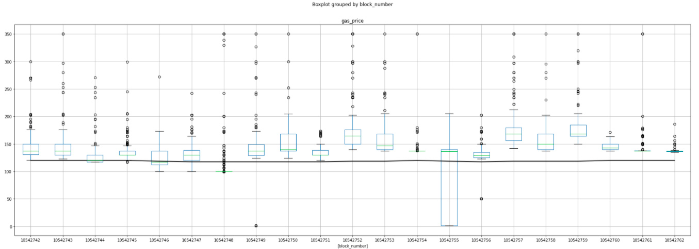
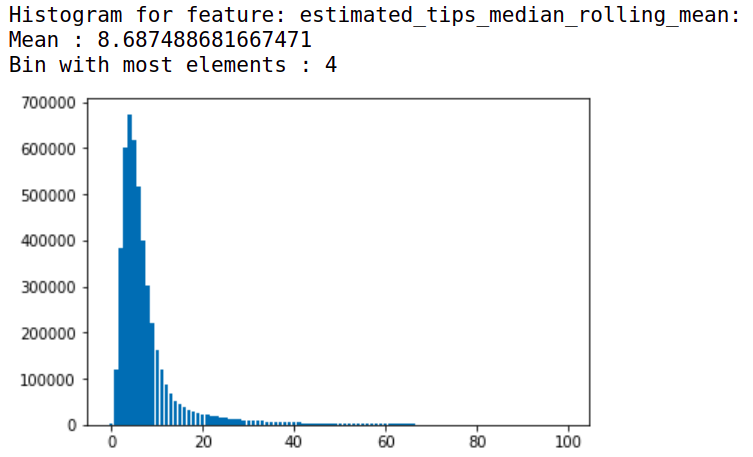
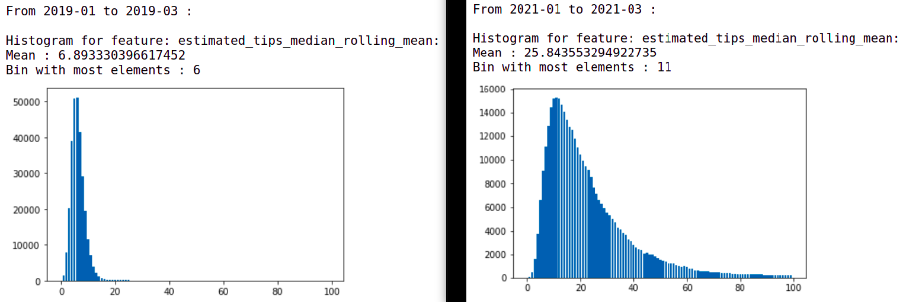
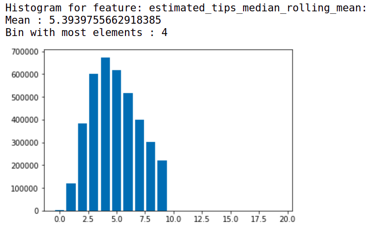
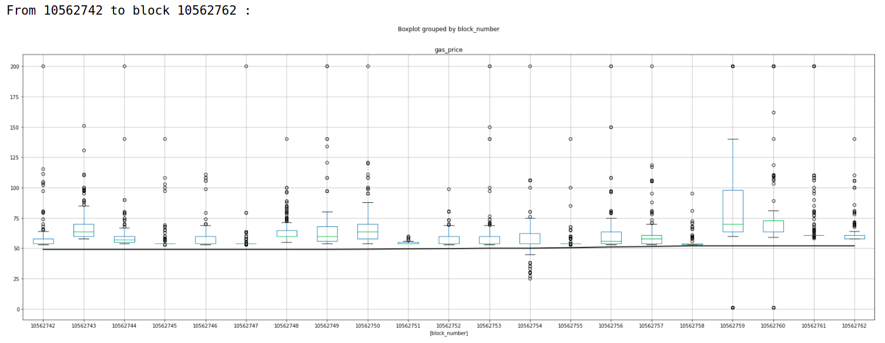
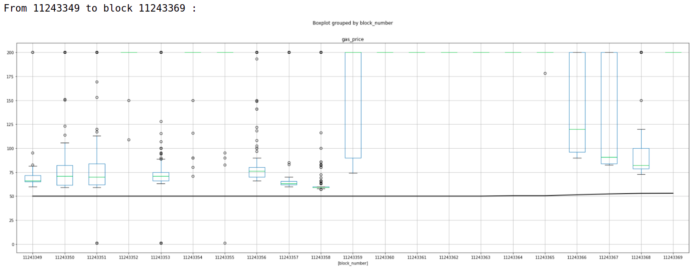
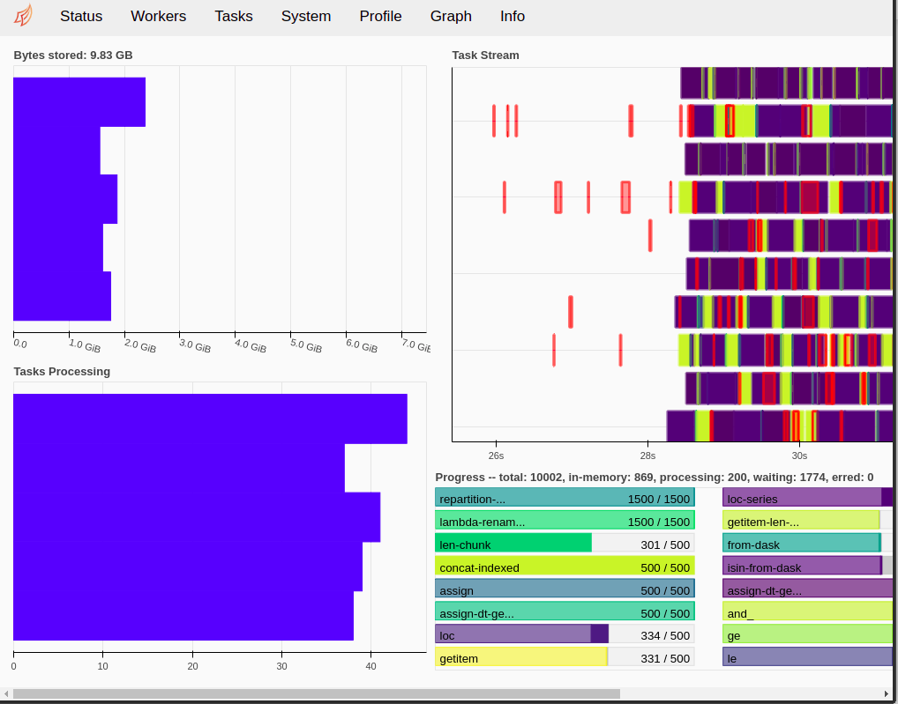

# EIP-1559: Analysis of the economical impact on miners

Can we estimate the economic impact of EIP-1559 on miners? 
This repository try to estimate the loss of miners' revenue coming from transactions fees, using Ethereum historical data.

This readme provide an overview of the results, but you can visit the
notebook there for more detailed information:
https://github.com/louisoutin/eip1559_analysis/blob/master/notebooks/1_gas_analysis.ipynb

## Analysis overview

This analysis uses Ethereum historical (gas prices) data from Google BigQuery. Based on the distribution of the gas
prices on the historical data this work try to give an estimate for the loss in revenues for a miners with eip-1559.
The notebook process data from January 2019 until February 2021 (included) for a total of 660 668 362 transactions.

The BASEFEE in the eip-1559 will be the minimum gas price to pay in order to have a transaction mined into the next block. 
It's not trivial to "translate" this BASEFEE for the current legacy system, but we can make some assumptions:
- We cannot use the minimum gas price of the block to represent his BASEFEE, cause this is currently highly unpredictable (actually that's one of the thing eip-1559 will resolve).
  Instead, for a given block, to have an equivalent of what would have been an "estimated" BASEFEE on the current legacy ethereum blockchain, 
  we can use the recommended gas price for that block. 
  On this work I use the Geth recommendation algorithm (60th percentile of the last 100 blocks).

When we look at the distribution of the gas prices per block (boxplots) 
over several blocks with the recommended gas price on top of it (black line), we
see that the median of the distribution follows this recommended gas price but in the
same time it is heavily influenced by highest bidders:

With the eip-1559 a part of the fees will be burnt and the miners will only receive
the tips as rewards. To simulate this mechanism on the legacy historical data, I made those
assumptions:

- The `estimated BASEFEE` correspond to the recommended gas price for a given block.

We use the recommended gas price because it is a more realistic/predictable value than the minimum gas price.

Note: the recommended gas price return the 60th percentile of the last 100 block's minimum gas prices.

- The `estimated tips` will be `gas_price - estimated BASEFEE`

- The eip-1559 should reduce inter-block variance of transactions' gas prices.

For that reason, I removed all the blocks from periods of high fees overpayment to sample an "artificial"
tips series per block from a distribution of "normal" tips behavior, details below.

When we plot the estimated tips distribution on the whole analysed range (2019 to 2021), we can see
an interesting shape in the median tips sent per block. We have a distribution that have a gaussian shape
BUT with a long thin right tail. This right tail corresponds to high overpayments blocks.

Another interesting plot is when we plot the same histogram but on a subset of a low
gas price period of January to March 2019 VS January to March 2021, we can clearly see
a big change in the distribution:

From that observation, I decided to clip all samples with a high estimated median tips (above 10 GWei overpay)
to get a more "normal" distribution out of the dataset:

This will be the reference blocks that will be used to simulate tips behavior under the eip-1559 fees mechanism.

To visualise the difference between low tips overpayment VS high tips overpayment periods,
we randomly sample a block from the clipped artificial dataset VS one from the 10 000 highest averaged tips period.

Example on low tips overpayment blocks:

Example on high tips overpayment blocks:

(note: values above 200 are clipped and thus not visible on the plot)

## Results

We compare the actual miners revenue VS the estimated maximum revenue VS the estimated revenue.

- the estimated maximum revenue is the estimation without taking into account the reduction
in gas price/tips variance while the estimated revenue is by taking into account this reduction.

Range | 2019-01 to 2021-03 | 2019-01 to 2019-03 | 2021-01 to 2021-03
--- | --- | --- | --- 
actual revenue | 5808504 eth | 100871 | 1963751
estimated minimal revenue (eip 1559) | 2016833 eth (65.28% loss) | 74796 (25.85% loss) | 589969 (69.96% loss)
estimated revenue (eip 1559) | 1375667 eth (76.32% loss) | 67478 (33.10% loss) | 263080 (86.60% loss)

## How to run the experiment ?

- You need Python 3.x and pip installed.

To install required dependencies, please run:

`pip install -r requirements.txt`

Then launch jupyter notebook, open and run `0_fetch_eth_txs .ipynb` to fetch
historical data on disk.

You can now open and run `1_gas_analysis.ipynb` to do the analysis.

I use Dask (https://dask.org/) for parallel computation with computational graph scheduling on multiple workers.
You can see a nice dashboard of the workers working there:

## Sources

- https://docs.google.com/spreadsheets/d/1nkSPk12XvwRGZ73J9ajQX3ue8PY02CAyuJuygcX7bY4/edit#gid=0
- https://github.com/ethereum/EIPs/blob/master/EIPS/eip-1559.md
- http://timroughgarden.org/papers/eip1559.pdf
- https://github.com/barnabemonnot/abm1559
- https://arxiv.org/abs/2003.03479